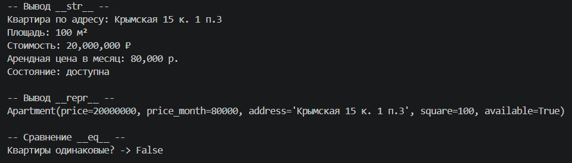
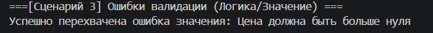
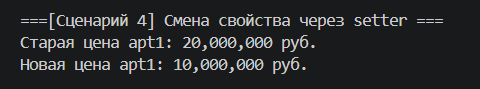
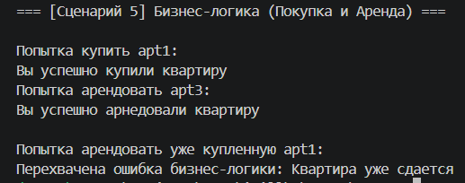

Cтудент группы БИВТ-25-8 Ищейкин Кирилл Алексеевич

# Лабораторная работа №1

## 1. Цель работы
Разработать базовый класс предметной области (Недвижимость) с использованием инкапсуляции, защиты данных (через `@property`), строгой валидации атрибутов и переопределением базовых магических методов.

## 2. Описание класса
**Класс:** `Apartment` (Квартира). Предназначен для представления объекта недвижимости с возможностью совершения операций покупки или аренды.

**Атрибуты (инкапсулированные, с проверкой через setter):**
*   `price` — цена покупки (в рублях).
*   `price_month` — стоимость аренды за месяц (в рублях).
*   `address` — адрес квартиры.
*   `square` — площадь (в м²).
*   `available` — доступность (True — свободна, False — занята/продана).

**Методы бизнес-логики:**
*   `rent(months, money)` — аренда квартиры. Проверяет корректность введенных данных, статус доступности и наличие достаточных средств. Успешная операция делает объект недоступным (`available = False`).
*   `buy(money)` — покупка квартиры. Проверяет доступность и средства. После успеха также снимает квартиру с продажи.

**Магические методы:**
*   `__str__()` — пользовательское форматированное представление объекта.
*   `__repr__()` — техническое представление объекта для отладки.
*   `__eq__()` — сравнение двух объектов `Apartment` по всем атрибутам.
*   `__lt__()` — сравнение двух объектов по цене (для сортировки).

## 3. Демонстрация работы

**Сценарий 1: Успешное создание объектов и магические методы**
Созданы два валидных объекта квартиры. Продемонстрирован вывод красивой информации для пользователя (метод `__str__`), вывод системной информации (метод `__repr__`) и сравнение двух разных квартир (метод `__eq__`, логично вернувший `False`).

**Сценарий 2: Перехват ошибки типа данных (TypeError)**
Произведена попытка создать объект квартиры, передав цену в виде строки вместо числа. Инкапсулированный валидатор успешно отловил попытку ввода неверного типа и выбросил `TypeError`, который был обработан.

**Сценарий 3: Перехват логической ошибки значения (ValueError)**
Произведена попытка создать квартиру с отрицательной ценой. Валидатор остановил операцию, так как цена должна быть строго больше нуля, и сгенерировал `ValueError`.

**Сценарий 4: Изменение атрибута через setter**
Демонстрация работы механизмов `getter` и `setter`. У успешно созданной квартиры была запрошена текущая цена, после чего ей было присвоено новое значение, которое успешно прошло внутреннюю валидацию и сохранилось в объекте.

**Сценарий 5: Работа бизнес-логики**
Демонстрация методов покупки и аренды квартиры с передачей достаточного количества средств. Программа выводит сообщение об успешной операции и изменяет внутреннее состояние объекта (статус `available`), блокируя повторные сделки с этой недвижимостью.

## 4. Вывод
В ходе выполнения работы были изучены и применены на практике основы ООП в Python: проектирование классов, сокрытие внутреннего состояния объектов (инкапсуляция) при помощи декоратора `@property`, вынос логики проверок входных данных в отдельные функции-валидаторы и переопределение магических методов для интеграции со встроенными механизмами Python.
