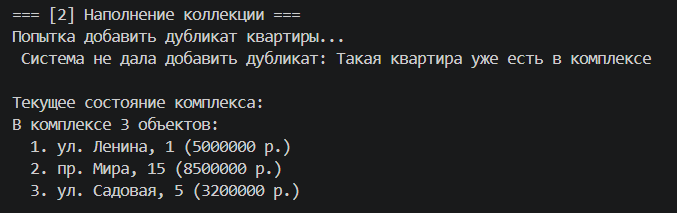
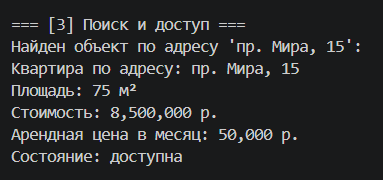
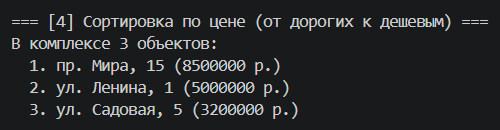
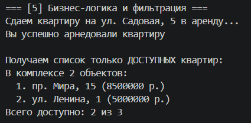

# Лабораторная работа №2

## 1. Цель работы

Изучение принципов работы с коллекциями в объектно-ориентированном программировании на Python, а также реализация собственного класса-коллекции с использованием инкапсуляции и магических методов.

## 2. Описание реализованной коллекции

**Класс коллекции**: `ResidentialComplex` (Жилой комплекс).
**Тип хранимых элементов**: объекты класса `Apartment` (Квартира).

**Реализованные пользовательские методы:**
*   `add(item)` — добавление новой квартиры в комплекс. Выполняет строгую проверку типа (ожидается только `Apartment`) и выбрасывает исключение при попытке добавить дубликат.
*   `remove(item)` — удаление квартиры из коллекции по точному совпадению переданного объекта.
*   `remove_at(index)` — удаление и возврат квартиры по ее индексу в списке с предварительной проверкой выхода за границы.
*   `find_by_address(address)` — линейный поиск и возврат первого объекта, адрес которого совпадает с заданным.
*   `sort_by_price()` — сортировка объектов внутри коллекции по убыванию цены (от самых дорогих к дешевым).
*   `get_available()` — фильтрация коллекции. Создает и возвращает новый экземпляр `ResidentialComplex`, содержащий только те квартиры, у которых статус `available` равен `True`.
*   `get_all()` — возвращает копию внутреннего списка объектов.

**Реализованные магические методы:**
*   `__init__()` — инициализация скрытого атрибута коллекции (пустого списка).
*   `__len__()` — поддержка встроенной функции `len()` для получения количества квартир в комплексе.
*   `__iter__()` — поддержка цикла `for`, возвращает итератор коллекции.
*   `__getitem__(index)` — поддержка обращения к конкретному элементу комплекса по индексу (например, `complex[0]`).
*   `__repr__()` — техническое строковое представление коллекции для отладки.
*   `__str__()` — пользовательское форматированное представление, выводящее заголовок с количеством объектов и пронумерованный список квартир с их адресами и ценами.

## 3. Демонстрация работы

**Сценарий 1: Создание объектов и валидация**
*   **Что рассматривалось:** Инициализация нескольких валидных объектов и попытка создания квартиры с заведомо некорректными данными (отрицательная цена `-100`).
*   **Как повел себя код:** Валидные объекты успешно сохранились в памяти. При некорректном вводе класс `Apartment` сгенерировал исключение `ValueError`, которое было успешно перехвачено в блоке `try-except`, программа продолжила работу, выведя сообщение об ошибке.
*   *Скриншот вывода терминала:* 

    

**Сценарий 2: Наполнение коллекции**
*   **Что рассматривалось:** Заполнение коллекции `ResidentialComplex` созданными ранее объектами и попытка добавить один и тот же объект дважды.
*   **Как повел себя код:** Первичные объекты добавлены успешно. При попытке повторно передать `apt1` метод `add` выбросил `ValueError`, не допустив дублирования данных. В конце сценария выведено текущее состояние коллекции с помощью магического метода `__str__`.
*   *Скриншот вывода терминала:* 

    

**Сценарий 3: Поиск и доступ**
*   **Что рассматривалось:** Поиск существующей квартиры по конкретному атрибуту (адресу «пр. Мира, 15»).
*   **Как повел себя код:** Метод `find_by_address` успешно нашел нужный объект в коллекции и вернул ссылку на него. Выведена информация о найденном объекте.
*   *Скриншот вывода терминала:* 

    

**Сценарий 4: Сортировка**
*   **Что рассматривалось:** Применение метода внутренней сортировки коллекции.
*   **Как повел себя код:** Элементы коллекции были отсортированы на месте (`in-place`) по стоимости в порядке убывания. Повторный вывод коллекции подтвердил изменение порядка элементов.
*   *Скриншот вывода терминала:* 

    

**Сценарий 5: Бизнес-логика и фильтрация**
*   **Что рассматривалось:** Имитация жизненного цикла объекта (сдача найденной квартиры в аренду) и последующий запрос списка свободных помещений.
*   **Как повел себя код:** Статус найденной квартиры изменился (объект перестал быть доступным). Вызов `get_available()` вернул новую коллекцию, в которой сданная квартира уже отсутствовала. Выведен список и подсчитано количество оставшихся доступных объектов.
*   *Скриншот вывода терминала:* 

    

**Сценарий 6: Удаление объектов**
*   **Что рассматривалось:** Удаление объекта из коллекции по его индексу.
*   **Как повел себя код:** Вызов `remove_at(0)` корректно извлек первую (самую дорогую после сортировки) квартиру из списка. Программа вывела адрес удаленной квартиры и обновленное (уменьшенное) количество элементов в комплексе.
*   *Скриншот вывода терминала:* 

    

## 4. Вывод

Что было изучено:

*   создание пользовательских классов-коллекций для управления группой объектов.
*   инкапсуляция данных и защита состояния объектов от некорректных изменений.
*   переопределение магических методов для глубокой интеграции собственного класса со встроенными функциями и операторами Python (итерирование, индексация, функция `len`, строковые представления).
*   обработка исключительных ситуаций на разных этапах: как при валидации атрибутов единичного объекта, так и при нарушении логики работы коллекции (дубликаты, выход за границы).